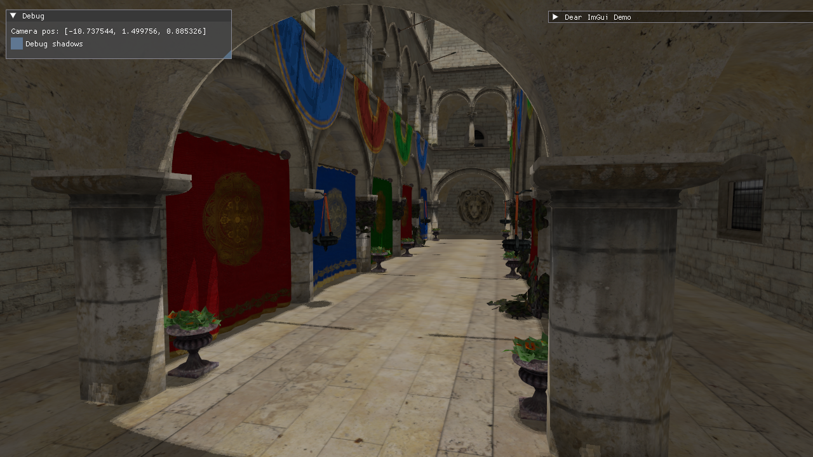

# Rebirth Game engine

C++20 Vulkan Game engine

## Features
* PBR (without IBL)
* Shadow maps
* Dynamic rendering (vulkan)
* Multisampling (MSAA)
* Mip map generation
* glTF scene loader
* Dear ImGui integration

## Third party libraries
* SDL3
* glm
* Dear ImGui
* cgltf
* stb
* volk
* VulkanMemoryAllocator
